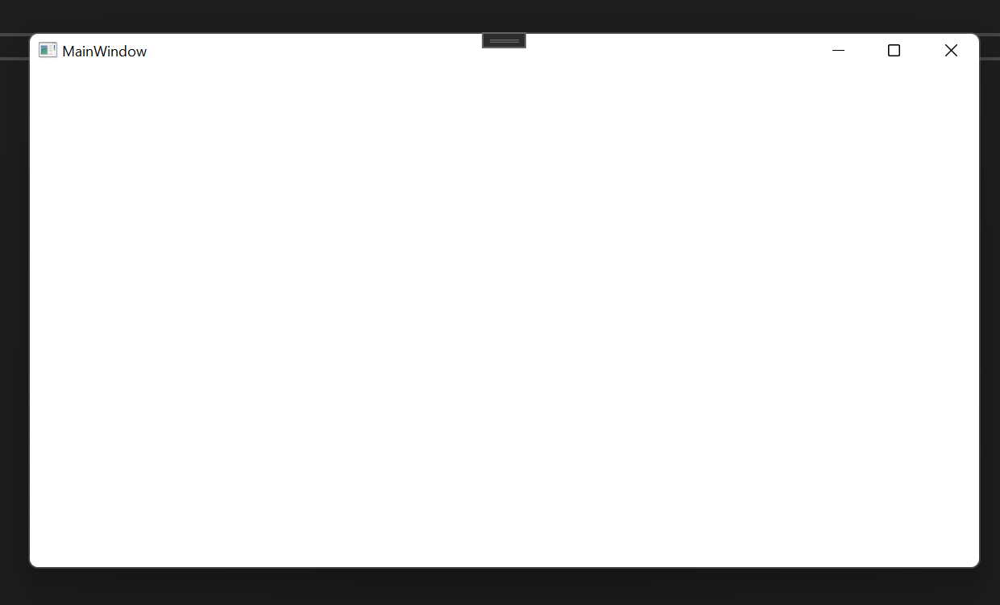
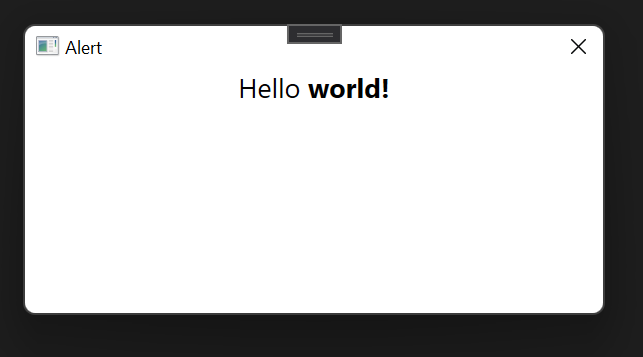

# splash-wpf-alert
Application built during our course asdf edit

The presentation is [here](https://docs.google.com/presentation/d/1QRbMPqXr-1q5bcPk3gc8NZn8k3acmAc5NdoBDdvXWD4/edit?usp=sharing)

We build a basic WPF application in just 60 minutes step by step by step!

## Checkpoint 1
Run a blank application 
[Checkpoint Code](https://github.com/thomashzhang/splash-wpf-alert/tree/checkpoint_1)

## Checkpoint 2
Hello world TextBlock
[Checkpoint Code](https://github.com/thomashzhang/splash-wpf-alert/tree/checkpoint_2)

## Checkpoint 3
Image and textblock together
[Checkpoint Code](https://github.com/thomashzhang/splash-wpf-alert/tree/checkpoint_3)

## Checkpoint 4
Add ignore, shutdown and log off buttons
[Checkpoint Code](https://github.com/thomashzhang/splash-wpf-alert/tree/checkpoint_4)

## Checkpoint 5
Add button logic and alert icon
[Checkpoint Code](https://github.com/thomashzhang/splash-wpf-alert/tree/checkpoint_5)

